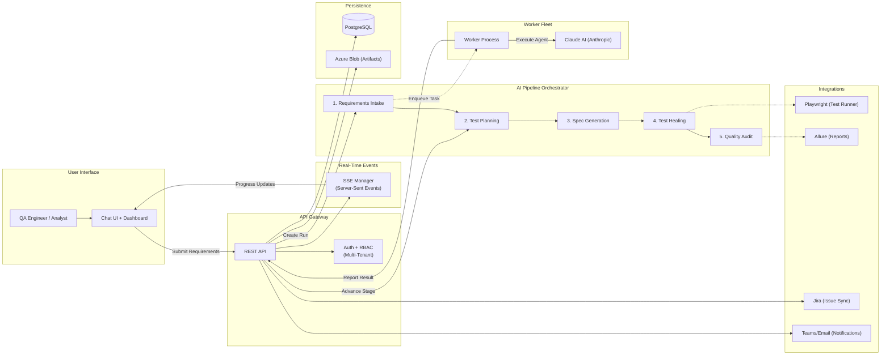

# JBSIntelliQE End-to-End System Architecture

Shows the complete flow from user input through the AI pipeline, real-time event system, and external integrations.

## Key Points

- **Event-driven pipeline**: Each stage is asynchronous — the orchestrator enqueues tasks, workers execute them via Claude AI, and results flow back to advance the pipeline. Dotted lines represent async/event-driven flows.
- **Self-healing loop**: If tests fail during execution (Stage 4), the healing agent automatically analyzes failures and regenerates fixes before the quality audit.
- **Convergence guards** prevent infinite loops: budget caps ($2/run, $0.50/stage), max iteration limits, and same-findings detection automatically terminate runs that aren't converging.
