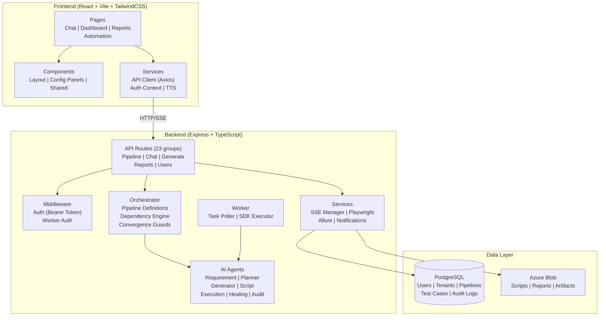

# JBSIntelliQE Logical Component Architecture

Organizes the system by logical layer — Frontend, Backend, and Data — showing major component groups and their relationships.

## Key Points

- **7 AI agents** form the core intelligence layer: each specializes in one pipeline stage (requirements analysis, test planning, code generation, script writing, execution, healing, and audit).
- **Orchestrator** manages pipeline flow with convergence guards (budget limits, max iterations, same-findings detection) to prevent runaway execution.
- **Multi-tenant isolation** is enforced at every layer — middleware attaches tenant context, services filter by tenant ID, and the frontend renders role-based navigation.
