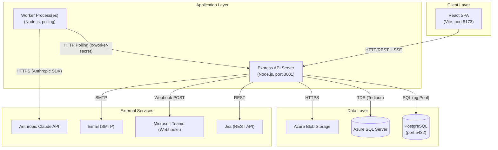

# JBSIntelliQE Infrastructure & Deployment Topology

High-level view of deployment components, their hosting, and communication protocols between them.

## Key Points

- **Worker isolation**: Worker processes are separate Node.js instances that authenticate via a shared secret and poll the API server for tasks — enabling horizontal scaling.
- **Real-time streaming**: The browser maintains an SSE (Server-Sent Events) connection to the API server for live pipeline progress updates without WebSocket overhead.
